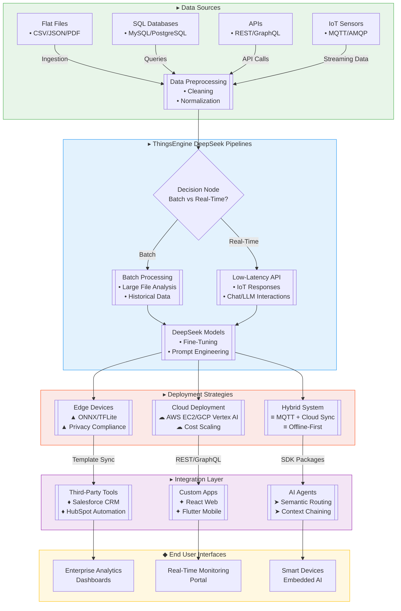

# **ThingsEngine-DeepSeek**
*A curated collection of resources, tools, and practical implementations for DeepSeek's cutting-edge language models*

---

[](https://opensource.org/licenses/MIT)
[](https://github.com/yourusername/ThingsEngine-DeepSeek/releases)
[](https://github.com/yourusername/ThingsEngine-DeepSeek/graphs/contributors)
[](https://github.com/yourusername/ThingsEngine-DeepSeek/stargazers)

---

### **Table of Contents**
- [Introduction](#introduction)
- [Key Features](#key-features)
- [Quick Links](#quick-links)
- [Installation & Setup](#installation--setup)
- [Usage Examples](#usage-examples)
- [Applications & Use Cases](#applications--use-cases)
- [Contributing](#contributing)
- [Community & Support](#community--support)
- [FAQs](#faqs)
- [License](#license)
- [Acknowledgments](#acknowledgments)
- [Disclaimer](#disclaimer)

---

## **Introduction**
DeepSeek is a state-of-the-art large language model (LLM) for natural language understanding, content generation, and domain-specific problem-solving. This repository focuses on **production-ready implementations**, developer tools, and real-world integrations to help engineers deploy DeepSeek effectively.

---

## **Key Features**
- **Deployment-Centric Tools**: Preconfigured APIs, Docker templates, and cloud integration scripts.
- **Optimized Models**: Quantized and pruned versions of DeepSeek for edge devices.
- **End-to-End Pipelines**: Complete workflows for NLP tasks (classification, summarization, RAG).
- **Performance Benchmarks**: Speed/memory metrics for different hardware setups.

---

## **Quick Links**
- [DeepSeek Official API Docs](https://api-docs.deepseek.com)
- [HuggingFace Models](https://huggingface.co/DeepSeek)
- [Prebuilt Docker Images](https://hub.docker.com/)
- [Production Template Gallery](./templates/)

---

## **Installation & Setup**
### **Prerequisites**
- Python 3.10+
- CUDA 12.x / ROCm 5.6+
- Docker Engine 24+ (optional)

```bash
# Install with production dependencies
pip install thingsengine-deepseek[prod]  # Includes FastAPI, Ray, Redis

# Clone this repository
git clone https://github.com/yourusername/ThingsEngine-DeepSeek.git
cd ThingsEngine-DeepSeek
```

### **One-Click Deployment (AWS/GCP)**
```bash
./deploy.sh --cloud=aws --instance=g5.2xlarge  # Automated Terraform + Ansible setup
```

## **Usage Examples**
### **REST API Server**
```Python
from thingsengine_deepseek import serve_api

serve_api(
    model="deepseek-7b-instruct-v2",
    port=8000,
    api_key="YOUR_KEY",
    enable_metrics=True  # Prometheus endpoint at /metrics
)
```

### **Batch Inference Pipeline**
```Python
from thingsengine_deepseek import BatchProcessor

processor = BatchProcessor(
    input_file="data/inputs.jsonl",
    output_file="data/results.csv",
    model="deepseek-1.3b-8bit"  # Quantized model
)
processor.run(batch_size=64)
```

