# **ThingsEngine-DeepSeek**
*A curated collection of resources, tools, and practical implementations for DeepSeek's cutting-edge language models*

---

[](https://opensource.org/licenses/MIT)
[](https://github.com/yourusername/ThingsEngine-DeepSeek/releases)
[](https://github.com/yourusername/ThingsEngine-DeepSeek/graphs/contributors)
[](https://github.com/yourusername/ThingsEngine-DeepSeek/stargazers)

---

### **Table of Contents**
- [Introduction](#introduction)
- [Key Features](#key-features)
- [Quick Links](#quick-links)
- [Installation & Setup](#installation--setup)
- [Usage Examples](#usage-examples)
- [Applications & Use Cases](#applications--use-cases)
- [Contributing](#contributing)
- [Community & Support](#community--support)
- [FAQs](#faqs)
- [License](#license)
- [Acknowledgments](#acknowledgments)
- [Disclaimer](#disclaimer)

---

## **Introduction**
DeepSeek is a state-of-the-art large language model (LLM) for natural language understanding, content generation, and domain-specific problem-solving. This repository focuses on **production-ready implementations**, developer tools, and real-world integrations to help engineers deploy DeepSeek effectively.

---

## **Key Features**
- **Deployment-Centric Tools**: Preconfigured APIs, Docker templates, and cloud integration scripts.
- **Optimized Models**: Quantized and pruned versions of DeepSeek for edge devices.
- **End-to-End Pipelines**: Complete workflows for NLP tasks (classification, summarization, RAG).
- **Performance Benchmarks**: Speed/memory metrics for different hardware setups.

---

## **Quick Links**
- [DeepSeek Official API Docs](https://api-docs.deepseek.com)
- [HuggingFace Models](https://huggingface.co/DeepSeek)
- [Prebuilt Docker Images](https://hub.docker.com/)
- [Production Template Gallery](./templates/)

---

## **Installation & Setup**
### **Prerequisites**
- Python 3.10+
- CUDA 12.x / ROCm 5.6+
- Docker Engine 24+ (optional)

```bash
# Install with production dependencies
pip install thingsengine-deepseek[prod]  # Includes FastAPI, Ray, Redis

# Clone this repository
git clone https://github.com/yourusername/ThingsEngine-DeepSeek.git
cd ThingsEngine-DeepSeek
```

### **One-Click Deployment (AWS/GCP)**
```bash
./deploy.sh --cloud=aws --instance=g5.2xlarge  # Automated Terraform + Ansible setup
```

## **Usage Examples**
### **REST API Server**
```Python
from thingsengine_deepseek import serve_api

serve_api(
    model="deepseek-7b-instruct-v2",
    port=8000,
    api_key="YOUR_KEY",
    enable_metrics=True  # Prometheus endpoint at /metrics
)
```

### **Batch Inference Pipeline**
```Python
from thingsengine_deepseek import BatchProcessor

processor = BatchProcessor(
    input_file="data/inputs.jsonl",
    output_file="data/results.csv",
    model="deepseek-1.3b-8bit"  # Quantized model
)
processor.run(batch_size=64)
```

## **Applications & Use Cases**

### Core Implementations
- **Natural Language Processing**
  ```markdown
  - [DeepSeek-R1] Smart Contract Analysis: Auto-audit Solidity/Vyper code
  - [DeepSeek-Chat] Legal Document Synthesis: Generate compliant templates
  ```

### Industry Solutions

```mermaid
flowchart LR
    E[E-Commerce] --> Q["📊 Review Sentiment Analysis"]
    F[Finance] --> R["💹 Fraud Detection Pipelines"]
    H[Healthcare] --> S["🩺 Clinical Trial Optimization"]
```

```mermaid
%% Architecture Diagram – Complete Integrated View

flowchart TB
    subgraph Data_Sources["▸ Data Sources"]
        A[Flat Files\n• CSV/JSON/PDF] --> |Ingestion| F
        B[SQL Databases\n• MySQL/PostgreSQL] --> |Queries| F
        C[APIs\n• REST/GraphQL] --> |API Calls| F
        D[IoT Sensors\n• MQTT/AMQP] --> |Streaming Data| F
    end

    subgraph Processing["▸ ThingsEngine DeepSeek Pipelines"]
        F[["Data Preprocessing\n• Cleaning\n• Normalization"]] --> G{Decision Node\nBatch vs Real-Time?}
        G --> |Batch| H[["Batch Processing\n• Large File Analysis\n• Historical Data"]]
        G --> |Real-Time| I[["Low-Latency API\n• IoT Responses\n• Chat/LLM Interactions"]]
        H --> J[["DeepSeek Models\n• Fine-Tuning\n• Prompt Engineering"]]
        I --> J
    end

    subgraph Deployment["▸ Deployment Strategies"]
        J --> K[["Edge Devices\n▲ ONNX/TFLite\n▲ Privacy Compliance"]]
        J --> L[["Cloud Deployment\n☁ AWS EC2/GCP Vertex AI\n☁ Cost Scaling"]]
        J --> M[["Hybrid System\n≡ MQTT + Cloud Sync\n≡ Offline-First"]]
    end

    subgraph Integration["▸ Integration Layer"]
        K -->|Template Sync| N[["Third-Party Tools\n♦ Salesforce CRM\n♦ HubSpot Automation"]]
        L -->|REST/GraphQL| O[["Custom Apps\n✦ React Web\n✦ Flutter Mobile"]]
        M -->|SDK Packages| P[["AI Agents\n➤ Semantic Routing\n➤ Context Chaining"]]
    end

    subgraph End_User["◆ End User Interfaces"]
        N --> Q[Enterprise Analytics\nDashboards]
        O --> R[Real-Time Monitoring\nPortal]
        P --> S[Smart Devices\nEmbedded AI]
    end

    style Data_Sources fill:#E8F5E9,stroke:#4CAF50
    style Processing fill:#E3F2FD,stroke:#2196F3
    style Deployment fill:#FBE9E7,stroke:#FF5722
    style Integration fill:#F3E5F5,stroke:#9C27B0
    style End_User fill:#FFF8E1,stroke:#FFC107
```





### [➕ Add Your Use Case](./examples) <!-- Link to use case templates -->

---

## **Contributing**

### First-Time Contributors
1. `Fork` this repository
2. Create branch: `git checkout -b feat/your-contribution`
3. Commit changes (`git commit -m 'Description'`)
4. `Push` to branch
5. Open `New Pull Request`

```bash
# For code contributions
pip install -r dev-requirements.txt  # Testing setup
pytest --cov=deepseek tests/        # Run validation
```

### Contribution Matrix
| Type         | Guidelines                          | Review SLA   |
|--------------|-------------------------------------|--------------|
| Bug Fixes    | Include replicable test case        | 48 hours     |
| New Features | Add API documentation + sample      | 72 hours     |
| Examples     | Use `%%export``` code blocks        | 24 hours     |

**[📜 Full Contribution Policy](/.github/CONTRIBUTING.md)** | **[💬 Code of Conduct](/.github/CODE_OF_CONDUCT.md)**

---

## **Community & Support**

### Official Channels
- **GitHub Discussions**: [Q&A](%%placeholder_github_link%%/discussions)
- **Slack Workspace**: [Join here](%%placeholder_slack_invite%%)
- **Stack Overflow**: Tag `#TE-deepseek`

### Community Events
```markdown
- 🧑💻 Monthly Hackathons: [View Calendar](%%placeholder_event_calendar%%)
- 🎥 "Office Hours" Live: Every Thursday 15:00 UTC
```

---

## **FAQs**

**Q1**: *DeepSeek vs. other LLMs?*
👉 Focused on Chinese-English alignment and code generation efficiency.

**Q2**: API access tiers?
```json
{
  "Free Tier": "5k tokens/month",
  "Pro Tier": "$0.002/1k tokens"
}
```

**Q3**: Custom model training?
Yes - [see finetuning guide](./docs/finetuning.md).

**Q4**: Hardware requirements?
Minimum: NVIDIA T4 (16GB VRAM). Recommended: A10G (24GB VRAM).

**Q5**: Commercial use?
MIT License allows commercial use with attribution.

---


## **Acknowledgments**

- Core Contributors: [List](./AUTHORS.md)
- Academic Partners: Tsinghua NLP Lab, Shanghai AI Lab
- Tools: HuggingFace Transformers, vLLM optimization
- Dataset Providers: [Disclaimer](#disclaimer)

---

## **Disclaimer**

1. **No Warranty**: Use at your own risk. No guarantees of performance.
2. **Content**: Outputs may contain inaccuracies - validate critically.
3. **Third-Party**: Linked resources independent of DeepSeek.
4. **Compliance**: User responsibility to follow local AI regulations.
